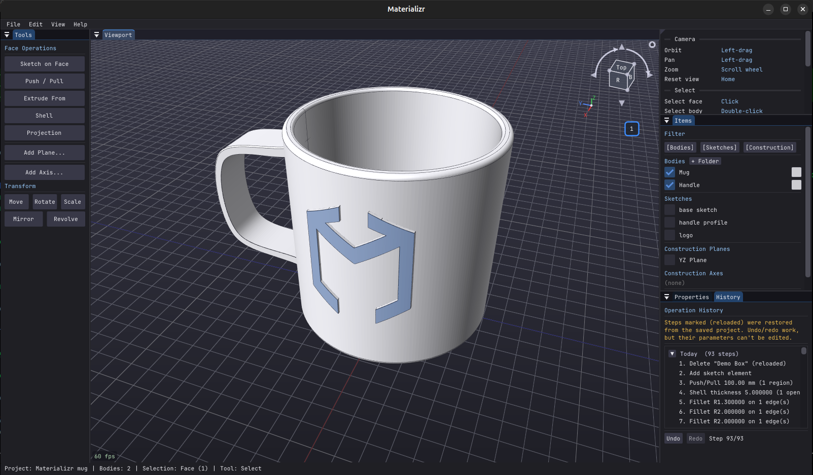

# Materializr

**Open-source parametric 3D CAD for makers** — constraint sketches, solid
modeling, threads, SVG & text engraving, STL/STEP/SVG export.

> **📱 Now on Android (1.0.0+):** Materializr runs on Android (arm64-v8a),
> reusing the entire geometry codebase via an SDL2 + OpenGL ES 3.0 backend and
> cross-compiled OpenCASCADE, with a runtime *touch mode* that adapts gestures
> and hit targets. **Designed for tablets** — a phone screen will be cramped.
> Grab the APK from the [latest release](https://github.com/materializr-cad/materializr/releases/latest),
> or see [`android/README.md`](android/README.md) to build it yourself.
> Also on [F-Droid](https://f-droid.org/packages/com.materializr.app/).

## Download

**[⬇ Get the latest release](https://github.com/materializr-cad/materializr/releases/latest)**

| Platform | File | How |
|---|---|---|
| Linux (x86_64 / aarch64) | `Materializr-*.AppImage` | `chmod +x` it and run — no install |
| Windows | `Materializr-Setup.exe` | run the installer |
| Windows (portable) | `Materializr-windows-x64.zip` | unzip anywhere, run `materializr.exe` |
| Android (F-Droid) | [on F-Droid](https://f-droid.org/packages/com.materializr.app/) | install + auto-update from the F-Droid app; tablets recommended |
| Android (latest APK) | `Materializr-*-arm64-v8a.apk` | sideload (enable "install unknown apps") for the freshest fixes; tablets recommended |
| macOS (Apple Silicon) | `Materializr-*-arm64.dmg` | open the `.dmg`, drag **Materializr** to Applications — see the first-launch note below |

> **Linux glibc requirement:** the AppImage is built on a current toolchain, so
> it needs **glibc 2.38 or newer** (Ubuntu 24.04+, Fedora 39+, Zorin 18+ — any
> 2024-or-later distro). On older systems it won't start, failing with
> `GLIBC_2.38 not found` / `GLIBCXX_3.4.32 not found`. If you're on an older
> distro, either [build from source](docs/building.md) — it compiles against
> your own libraries, so there's no version floor — or run the AppImage inside
> an `ubuntu:24.04` [Distrobox](https://distrobox.it/) / Toolbox container.

> **Prefer F-Droid?** It builds each release from source on its own
> roughly-weekly cadence, so a brand-new bug fix can take a few days to reach it.
> If you're chasing a fix we just shipped, the GitHub APK above will have it
> first. One caveat: F-Droid signs its build with its own key, so you can't
> install the GitHub APK over an F-Droid install (or vice-versa) — Android
> rejects the signature change. Switching sources means uninstalling first,
> which clears the app's on-device files, so export any projects you want to
> keep beforehand. Easiest is to pick one source and stick with it.

> **macOS first launch:** the app is Apple-Silicon only (M1 or newer) and is
> ad-hoc signed, not notarized — so the first time you open it, macOS
> Gatekeeper will say it "cannot be opened because the developer cannot be
> verified." Right-click (or Control-click) the app in Applications and choose
> **Open**, then **Open** again in the dialog — this is a one-time approval.
> (Equivalently: System Settings → Privacy & Security → **Open Anyway**.)

Built on the [OpenCASCADE](https://dev.opencascade.org/) geometry kernel —
real B-rep solids, not meshes — with a Dear ImGui interface. Sketch on any
face or construction plane, pull it into a solid, keep editing any step of
the history later (even after closing the project).

## What it is (and isn't)

Materializr **isn't trying to replace** SolidWorks, Fusion 360, FreeCAD, or any
other CAD program. It aims for the **middle ground between dead-simple and
fully-featured** — enough genuine parametric solid modeling to make real parts,
without a steep learning curve, a subscription, or an account. If you've ever
found beginner tools too limiting and pro tools too heavy, that gap is what
this is for.

It's also **young software built quickly, so expect rough edges — there are
bugs we haven't found yet.** The good news: operations validate their results
and *refuse* rather than silently produce garbage, so a failed action leaves
your model untouched instead of corrupting it. Still: **save often**, and if
something behaves oddly, a bug report is the most useful thing you can send.

## What it does

**Sketch** — lines, circles, arcs, splines, polygons, rectangles with
SketchUp-style inference snapping (endpoints, midpoints, perpendicular,
tangent, 15° increments) and opt-in dimensions & constraints. **Text** as
real outline geometry (three bundled fonts) and **SVG import** with live
placement preview — both become ordinary closed regions you can extrude.

**Model** — push/pull, extrude, **lathe** (spin a sketch profile around an
axis into a solid), **revolve** (rotate a body around an axis — watch a fan
spin or a hinge open), loft, booleans, fillet/chamfer, shell, mirror,
linear & circular patterns, split. Drop in a **primitive** (box,
cylinder, sphere, cone, torus) when that's the faster start. Direct face
editing: **taper** (draft), **scale face** (pinch a wing tip into a winglet),
**twist a face** about its normal to spiral the walls, edit a hole or boss to
an exact diameter.

**Detail** — validated **screw threads** (internal & external, standard
coarse defaults from the diameter), and **Projection**: engrave or emboss
any sketch onto a flat *or curved* face — wrap a logo around a cylinder in
three clicks.

**Stay in control** — every operation is an editable history step;
projects reload with the history still editable. Construction planes &
axes, **Section View** with any cutting plane, version snapshots with
auto-save, undo everywhere.

**Exchange** — STEP and IGES import/export, STL and glTF export
(Z-up corrected for printing), **sketch → SVG export** (1:1 mm, for laser
cutters and 2.5D CNC), SVG import, PNG viewport export, and a
compact native `.materializr` format that stores bodies, sketches, and
the full history.

## Known limitations

A few rough edges are deliberate trade-offs for now, not bugs — worth knowing
up front:

- **Editing a body *after* you move it works only if it has no fillets,
  chamfers, or booleans.** Move a plain extruded body and its sketch stays
  linked, so you can keep tweaking dimensions. Move one that's been filleted or
  cut, and the link is dropped (the move is still fine — you just can't
  re-derive it from the sketch afterward). *Why:* re-deriving means re-applying
  those features to the moved shape, and that needs stable face/edge IDs that
  survive the move (the classic "topological naming" problem). Until that
  subsystem lands, a featured body de-links on move rather than risk a wrong or
  broken result.

- **Threads have to be the last thing you do to a body.** Once a part is
  threaded, further operations on it are refused with a prompt to delete the
  thread, make your change, and re-apply it. *Why:* a thread is heavy,
  per-turn geometry; re-running cuts or fillets across it is unreliable, so
  threading is treated as a terminal finishing step rather than something you
  build on top of.

- **Chamfering an edge that meets a fillet fails.** If a chamfer's edge runs
  into a rounded (filleted) edge, the operation is refused where the chamfer and
  the swept fillet surface intersect — there's no tolerance setting that rescues
  it. *Why:* it's an upstream limit in OpenCASCADE's chamfer builder, not
  something a knob fixes. *Workaround:* cut the chamfer with a sketch instead, or
  chamfer the edge before you fillet its neighbour.

The first two ease once topological naming lands; the chamfer/fillet case is an
upstream OpenCASCADE limit we're tracking for a cut-based fallback. All three
are on the roadmap.

## Documentation

- **[Getting Started](docs/getting-started.md)** — install + your first sketch in five minutes.
- **[Features](docs/features.md)** — full list of what every tool does.
- **[Usage Guide](docs/usage.md)** — workflow recipes and keyboard shortcuts.
- **[Building from Source](docs/building.md)** — native Linux, Docker AppImage, Windows (MSVC + vcpkg).
- **[Architecture](docs/architecture.md)** — code layout, design patterns, tech stack.
- **[Changelog](docs/changelog.md)** — release notes and known issues.

The app ships an in-app **Help → User Guide**, a **Keyboard Shortcuts**
panel, and **Help → Check for Updates**.

## Video Tutorial

A walkthrough from a first sketch to a printable part:

## License

GNU GPLv3 — see [LICENSE](LICENSE). (Releases through 0.9.7.1 were MIT; the
project is GPLv3 from here on.)

## Contributing

Contributions welcome — bug reports and missing-workflow notes especially;
real-world dogfooding is what hardens each release. Open an issue first for
substantial changes; small fixes can go straight to a PR.

Join the community on **[Discord](https://discord.gg/BRjzbMGZvE)** for questions, show-and-tell, and development chat.

## Credits

- **R4stl1n** — original project.
- **stevebushwa** — design, testing, direction.
- **Claude (Anthropic)** — pair-coding collaborator.

## Acknowledgments

Materializr is built on a stack of excellent open-source projects — none of
this would exist without them.

**Geometry & math**

- [OpenCASCADE Technology](https://dev.opencascade.org/) — B-rep solid
  modelling kernel (LGPL with Open CASCADE exception).
- [GLM](https://github.com/g-truc/glm) — OpenGL-friendly C++ math (MIT).

**Graphics & windowing**

- [Dear ImGui](https://github.com/ocornut/imgui) — immediate-mode GUI,
  used for every panel and overlay (MIT).
- [GLFW](https://www.glfw.org/) — window, input, and OpenGL context
  creation (zlib).
- [GLEW](https://glew.sourceforge.net/) — OpenGL extension loading on
  Windows (modified BSD / MIT).

**File I/O & exchange**

- [nanosvg](https://github.com/memononen/nanosvg) — SVG parser for the
  sketch SVG-import tool (zlib).
- [libcurl](https://curl.se/libcurl/) — HTTPS GET for Help → Check for
  Updates (curl license).
- [zlib](https://zlib.net/) — gzip stream for the v3 `.materializr`
  project format (zlib license).
- [portable-file-dialogs](https://github.com/samhocevar/portable-file-dialogs)
  — single-header bridge to the host's native Open / Save dialog
  (WTFPL). Lets you save to SMB / NFS / cloud mounts the OS file manager
  already knows about.

**Bundled fonts**

- [JetBrains Mono](https://www.jetbrains.com/lp/mono/) — UI font
  (SIL Open Font License 1.1).
- [DejaVu Sans](https://dejavu-fonts.github.io/) and DejaVu Serif —
  shipped as choices for the sketch Text tool (DejaVu Fonts License,
  derived from Bitstream Vera).
